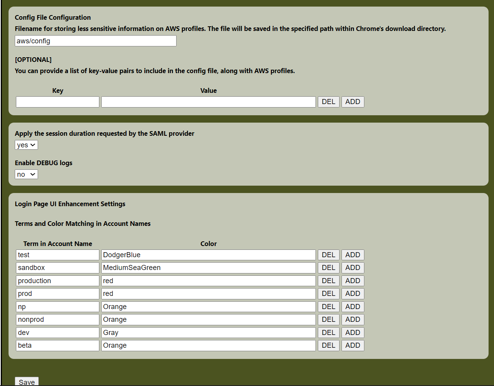

# SAML to AWS STS Keys Conversion - Multi Profile (mp)

This extension is a forked version of the awesome "[samltoawsstskeys](https://github.com/prolane/samltoawsstskeys)" project by "prolane." I want to thank youthe original author for his incredible idea and hard work!

The inspiration from "samltoawsstskeys" motivated me to develop "samltoawsstskeys-mp" that helps to save keys for mutiple roles with named profiles and some other login page enhancements.

Options




Login Page Enhancements


# Donation

* If you appreciate the work I've done on "samltoawsstskeys-mp" and it has been helpful to you, I kindly ask that you consider donating to help those in need of food here at [UN World Food Programme](https://www.wfp.org/) . Let's make a difference together!

# Readme from samltoawsstskeys

Google Chrome Extension, which converts a SAML 2.0 assertion to AWS STS Keys (temporary credentials). Just log in to the AWS Web Management Console using your SAML IDP, and the Chrome Extension will fetch the SAML Assertion from the HTTP request. The SAML Assertion is then used to call the assumeRoleWithSAML API to create the temporary credentials. (AccessKeyId, SecretAccessKey and SessionToken).

The Chrome Extension can be downloaded here:
[Google Chrome Web Store](https://chrome.google.com/webstore/detail/ekniobabpcnfjgfbphhcolcinmnbehde/)

> The source of this extension is also used as [extension](https://addons.mozilla.org/en-US/firefox/addon/saml-to-aws-sts-keys/) for Mozilla FireFox. For specific FireFox related questions you can get in touch with my awesome friend @gbvanrenswoude.

# Table of Contents
* [Why this Chrome Extension?](#why)
* [Getting Started from source](#gettingstarted)
* [Plugin Development Notes](#development)
* [Frequently Asked Question](#faq)

## <a name="why"></a>Why this Chrome Extension?
If you don't have any user administration setup within AWS Identity & Access Management (IAM) but instead rely on your corporate user directory, i.e. Microsoft Active Directory. Your company uses a SAML 2.0 Identity Provider (IDP) to log in to the AWS Web Management Console (Single Sign On).
Then this Chrome Extension is for you!

You run into trouble as soon as you want to execute some fancy scripts from your computer, which call the AWS API. When sending a request to the AWS API, you need credentials, meaning AccessKey and SecretKey. You can quickly generate these keys for each user in AWS IAM. However, since you don't have any users in AWS IAM and don't want to create users just for the sake of having an AccessKey and SecretKey, you are screwed. But there is a way to get temporary credentials specifically for your corporate identity.

The Security Token Service (STS) from AWS provides an API action assumeRoleWithSAML. Using the SAML Assertion given by your IDP, the Chrome Extension will call this API action to fetch temporary credentials. (AccessKeyId, SecretAccessKey and SessionToken). This way, there is no need to create some anonymous user in AWS IAM used for executing scripts. This would be an absolute security nightmare since it is impossible to audit who did what. This Chrome Extension, however, will make it super easy for you to use your corporate identity for executing scripts calling AWS API.

## <a name="gettingstarted"></a>Getting Started from source
1. Clone this repository
2. Open Chrome and go to `chrome://extensions/`
3. Enable Developer Mode
4. Click on "Load unpacked extension..."
5. Select the folder where you cloned this repository
6. Enjoy!

## <a name="development"></a>Plugin Development Notes
Here are some important notes for development of this plugin.

### AWS SDK with webpack
The AWS SDK for Javascript is packaged with webpack. npm and webpack configuration is located in `lib/aws-sdk/build`.

To install a specific version of an AWS SDK module, go into the build directory and run:
```
npm install --save --save-exact @aws-sdk/client-sts@3.209.0
```

To simply install the required node modules and build the sdk library required for the plugin:
```
npm install
npm run build
```

## <a name="faq"></a>FAQ: Frequently Asked Question
1. How to check for errors in the extension?
    * Go to the options page of the extension
    * Set 'Enable DEBUG logs' to 'yes' and hit the 'Save' button below
    * Go to the Chrome Extensions page and look for the 'SAML to AWS STS Keys Conversion' extension
    * Click on the link where it says 'Inspect views'
    * A new Chrome DevTools window should pop up, with the 'Console' tab already selected. This is where you'll be able to view all logs.
    * Perform a new login and check the logs to see if there are any errors.

2. Why can I not save the credentials file somewhere else?
With security in mind Google has limited the Chrome browser to only read and write to the Chrome Downloads directory. This way none of your Chrome extension will be able to steal data from your computer.

3. How long are the credentials valid?
AWS calls this 'session duration'. The default session duration is 1 hour. The maximum session duration is configured in AWS IAM as an attribute of the IAM Role. Your IDP might be configured to pass along an additional SAML claim which requests to apply a custom session duration. This value can be configured to be higher than the default of 1 hour. However, this can never be higher than the configured maximum session duration on the IAM Role as this will result in an error.

4. Create a symlink to your .aws directory
TODO